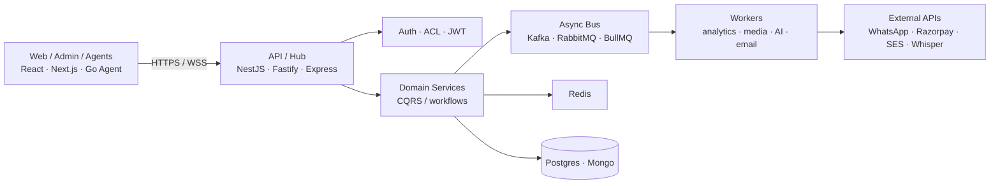

<!--
  PREVIEW — GitHub Profile README rewrite for musavirchukkan
  Sourced from https://musavirchukkan.in + public GitHub data.
  Review here first. After confirmation, copy into musavirchukkan/musavirchukkan.
-->

<div align="center">
  <a href="https://musavirchukkan.in">
    
  </a>
</div>

<p align="center">
  <a href="https://musavirchukkan.in"></a>
  <a href="mailto:abdulmusavirc@gmail.com"></a>
  <a href="https://www.linkedin.com/in/musavirchukkan/"></a>
  <a href="https://twitter.com/musavir_chukkan"></a>
  
</p>

<p align="center">
  
  
  
  
</p>

---

## `~/system` — engineer profile

```bash
$ cat ~/.profile
name:        Abdul Musavir Chukkan
role:        Senior Software Engineer · Full Stack
employer:    Singularis Ventures · Aula   # Jun 2025 → present
prior:       Axel Technologies / Workpex # Aug 2023 → Jun 2025
focus:       [microservices, realtime, CQRS, PaaS, integrations]
stack:       [Go, TypeScript, NestJS, Node.js, React, Next.js,
              PostgreSQL, Redis, Kafka, RabbitMQ, Docker, AWS]
impact:      Workpex load time 30s → 6s (~80%); enterprise WhatsApp + FB Lead APIs
status:      open_to_opportunities=true
site:        https://musavirchukkan.in
```

I design backends that stay correct under pressure — **CQRS hot paths**, **realtime gateways**, **multi-tenant SaaS**, and **self-hosted control planes** — then wire them to product UIs that operators can actually use.

<details>
<summary><strong>▸ Expand: current engineering focus</strong></summary>

<br/>

| Domain | What I'm shipping |
| --- | --- |
| **Hot-path systems** | URL redirect engines, bid loops, WebSocket fan-out — isolate spike traffic from management APIs |
| **Control planes** | Agent/Hub PaaS patterns (outbound WSS, least-privilege Docker) |
| **Product backends** | NestJS / Express / Fastify services with Prisma/Drizzle, Redis, queues |
| **AI pipelines** | Whisper → LLaMA quiz generation; browser-side Gemini/OpenAI analysis |
| **Integrations** | WhatsApp Cloud API, Facebook Lead API, Twilio, Razorpay, SES |
| **Ops** | Docker Compose, dual-VPS GitHub Actions deploys, Cloudflare edge |

</details>

---

## Experience

| When | Role | Org | Highlights |
| --- | --- | --- | --- |
| **Jun 2025 – Present** | Software Engineer | [Singularis Ventures · Aula](https://musavirchukkan.in) | Node.js / Express / NestJS backends, Docker + AWS, REST + SES |
| **Aug 2023 – Jun 2025** | Associate Software Engineer | Axel Technologies — Workpex | FB Lead + WhatsApp Cloud APIs, WebSockets, scheduled reports; **30s → 6s** page load |
| **Aug 2022 – Aug 2023** | Jr. AI Developer | TENZOTECH | Python + web stack; SDLC across design/build/test |
| **Feb 2021 – Apr 2022** | Webmaster | IEEE SB MESCE | 5 sites, payments/hosting/SSL; IEEE appreciation award |
| **Feb 2020 – Jan 2021** | Vice Chair, CS | IEEE SB MESCE | Chapter growth + technical programming |

---

## Architecture I typically ship



<details>
<summary><strong>▸ Expand: design defaults</strong></summary>

- **Split hot paths** from management planes (ClickIt-style CQRS) so viral traffic can't sink billing/auth
- **Agents dial out** — no Docker socket on the control plane (Wharf trust model)
- **Idempotent consumers** + DLQs; Redis idempotency on payment webhooks
- **Multi-tenant isolation** as a first-class invariant (DocAssist clinic boundaries)
- **Contract-first APIs** (OpenAPI) + typed TS clients when possible
- **Observability**: structured logs, request IDs, Sentry by service

</details>

---

## Featured systems

Curated from [musavirchukkan.in/projects](https://musavirchukkan.in/projects). Portfolio write-ups for private work; GitHub where public.

<table>
  <tr>
    <td width="50%" valign="top">
      <h3><a href="https://musavirchukkan.in/projects/clickit">ClickIt</a></h3>
      <p><code>Go</code> · CQRS · Kafka · Redis · Mongo · Next.js</p>
      <p>Distributed URL shortener for high-concurrency redirects. CQRS planes isolate the redirect hot path; Kafka buffers click analytics; Redis/Mongo serve read models. OpenAPI + Docker Compose ops story.</p>
      <p>
        
        
      </p>
    </td>
    <td width="50%" valign="top">
      <h3><a href="https://musavirchukkan.in/projects/wharf">Wharf</a></h3>
      <p><code>Go</code> · NestJS · React · WSS · Docker · SQLite</p>
      <p>Self-hosted PaaS control plane. Go Agents own Docker on each VPS; NestJS Hub holds desired state over outbound WebSockets; React UI operates projects without mounting the Docker socket on the hub.</p>
      <p>
        
        
      </p>
    </td>
  </tr>
  <tr>
    <td width="50%" valign="top">
      <h3><a href="https://github.com/musavirchukkan/AuctionForge">AuctionForge</a> · <a href="https://musavirchukkan.in/projects/auctionforge">write-up</a></h3>
      <p><code>NestJS</code> · React · Socket.IO · Postgres · Redis · RabbitMQ</p>
      <p>Realtime car auction bidding under concurrent load — JWT-secured WebSockets, Prisma/Postgres, Redis live state, RabbitMQ async bid/notification pipeline.</p>
      <p>
        
        
      </p>
    </td>
    <td width="50%" valign="top">
      <h3><a href="https://musavirchukkan.in/projects/printforge">PrintForge (BRUT)</a> · <a href="https://wearbrut.in">live</a></h3>
      <p><code>Fastify</code> · Next.js · BullMQ · Neon · Razorpay · R2</p>
      <p>Productized print-on-demand for BRUT — API + storefront + Sharp/BullMQ worker. Money in paise, Redis webhook idempotency, Cloudflare R2 uploads, Shiprocket shipping.</p>
      <p>
        
        
      </p>
    </td>
  </tr>
  <tr>
    <td width="50%" valign="top">
      <h3><a href="https://musavirchukkan.in/projects/docassist">DocAssist</a></h3>
      <p><code>Express</code> · Prisma · Postgres · React · Redis</p>
      <p>Multi-tenant clinic SaaS with strict patient isolation, multi-device JWT sessions, cross-clinic conflict detection, dual-VPS GitHub Actions deploys.</p>
      <p>
        
        
      </p>
    </td>
    <td width="50%" valign="top">
      <h3><a href="https://musavirchukkan.in/projects/video-quiz-generator">Video Quiz Generator</a></h3>
      <p><code>NestJS</code> · FastAPI · Whisper · LLaMA · Bull · React</p>
      <p>AI pipeline: lecture upload → Bull/Redis jobs → Whisper transcription → Ollama LLaMA MCQs → streamed progress to user/admin portals.</p>
      <p>
        
        
      </p>
    </td>
  </tr>
  <tr>
    <td width="50%" valign="top">
      <h3><a href="https://musavirchukkan.in/projects/careerstack-ai">CareerStack AI</a></h3>
      <p><code>Chrome Ext</code> · Gemini · OpenAI · Notion · Vite</p>
      <p>Job-application tracker extension: scrape LinkedIn/Indeed → AI resume match score → save structured Notion entries. Keys & data stay in-browser.</p>
      <p>
        
        
      </p>
    </td>
    <td width="50%" valign="top">
      <h3><a href="https://musavirchukkan.in/projects/expenseflow">ExpenseFlow (Azorfi)</a></h3>
      <p><code>Express</code> · Next.js · Expo · Prisma · S3</p>
      <p>Relationship-aware expense tracker across API, web, and React Native — JWT, Zod validation, S3 receipts, shared spending charts.</p>
      <p>
        
        
      </p>
    </td>
  </tr>
</table>

<details>
<summary><strong>▸ More public GitHub projects</strong></summary>

<br/>

| Repo | Notes |
| --- | --- |
| [identity-reconciliation](https://github.com/musavirchukkan/identity-reconciliation) · [write-up](https://musavirchukkan.in/projects/identity-reconciliation) | Contact identity graph / entity resolution |
| [email-microservice](https://github.com/musavirchukkan/email-microservice) · [write-up](https://musavirchukkan.in/projects/email-microservice) | Isolated mail delivery boundary |
| [customer-traffic-dashboard](https://github.com/musavirchukkan/customer-traffic-dashboard) · [write-up](https://musavirchukkan.in/projects/customer-traffic-dashboard) | Traffic analytics UI |
| [Habit0](https://github.com/musavirchukkan/Habit0) | Habit tracker with streak rewards |
| [mern-todo](https://github.com/musavirchukkan/mern-todo) | MERN todo · [live](https://todo.musavirchukkan.in/) |

Full index → [musavirchukkan.in/projects](https://musavirchukkan.in/projects)

</details>

---

## Interactive toolbox

<details open>
<summary><strong>▸ Tech arsenal</strong> (from portfolio)</summary>

<br/>

**Languages**  
[](https://go.dev/)
[](https://www.typescriptlang.org/)
[](https://developer.mozilla.org/en-US/docs/Web/JavaScript)
[](https://www.python.org/)
[](https://www.php.net/)
[](https://isocpp.org/)
[](https://en.cppreference.com/w/c)

**Backend & frontend**  
[](https://nodejs.org/)
[](https://nestjs.com/)
[](https://expressjs.com/)
[](https://fastify.dev/)
[](https://laravel.com/)
[](https://react.dev/)
[](https://nextjs.org/)
[](https://expo.dev/)

**Data, cache, messaging**  
[](https://www.postgresql.org/)
[](https://www.mongodb.com/)
[](https://redis.io/)
[](https://kafka.apache.org/)
[](https://www.rabbitmq.com/)
[](https://socket.io/)

**Cloud, AI & delivery**  
[](https://aws.amazon.com/)
[](https://www.docker.com/)
[](https://github.com/features/actions)
[](https://www.cloudflare.com/)
[](https://www.tensorflow.org/)
[](https://openai.com/)

</details>

<details>
<summary><strong>▸ Reliability checklist I run before ship</strong></summary>

```text
[ ] hot path isolated from management / billing planes
[ ] request timeouts + circuit breakers on external I/O
[ ] idempotency keys on payment / create / webhook handlers
[ ] queue retries + DLQ + alert on poison messages
[ ] authz on every mutating route (not just authn)
[ ] tenant / clinic isolation verified with negative tests
[ ] migration rollback + backward-compatible schema changes
[ ] load test hot path (p95 / error budget) before go-live
```

</details>

<details>
<summary><strong>▸ Certifications snapshot</strong></summary>

<br/>

- **Google Cloud** — 13 skill badges (networking, K8s, BigQuery ML, DevOps, security) · Feb 2025 · [list](https://musavirchukkan.in/certifications)
- **HackerRank** — SQL (Basic), Software Engineer Intern
- **Duke University** — Programming Fundamentals
- **University of Michigan** — Programming for Everybody (Python)

</details>

<details>
<summary><strong>▸ Competitive programming</strong></summary>

<br/>

<p>
  <a href="https://leetcode.com/musavirchukkan/"></a>
  <a href="https://www.hackerrank.com/musavirchukkan"></a>
  <a href="https://www.codechef.com/users/musavirchukkan"></a>
</p>

</details>

---

## Live metrics

<div align="center">
  <!-- Official github-profile-trophy.vercel.app returns 402 DEPLOYMENT_DISABLED; use a community load-balancing mirror -->
  <a href="https://github.com/ryo-ma/github-profile-trophy">
    
  </a>
</div>

<div align="center">
  <picture>
    <source media="(prefers-color-scheme: dark)" srcset="https://github-readme-stats.vercel.app/api?username=musavirchukkan&show_icons=true&theme=dark&hide_border=true&count_private=true&include_all_commits=true" />
    
  </picture>
  <picture>
    <source media="(prefers-color-scheme: dark)" srcset="https://streak-stats.demolab.com?user=musavirchukkan&theme=dark&hide_border=true" />
    
  </picture>
</div>

<div align="center">
  <picture>
    <source media="(prefers-color-scheme: dark)" srcset="https://github-readme-stats.vercel.app/api/top-langs/?username=musavirchukkan&layout=compact&theme=dark&hide_border=true&langs_count=8" />
    
  </picture>
  
</div>

---

## Contribution snake

<!-- SNAKE:START -->
<div align="center">
  <picture>
    <source media="(prefers-color-scheme: dark)" srcset="./assets/github-contribution-grid-snake-dark.svg" />
    
  </picture>
</div>
<!-- SNAKE:END -->

<details>
<summary><strong>▸ How this animation stays fresh</strong></summary>

<br/>

Generated from my contribution grid via [Platane/snk](https://github.com/Platane/snk).  
The included Action regenerates `./assets/*.svg` daily.

</details>

---

## Achievements

| | |
| --- | --- |
| 🏅 | **Best Performer** — Axel Technologies (2 consecutive periods) |
| ⚡ | **~80% faster Workpex** — 30s → 6s load time |
| 🧊 | **Arctic Code Vault Contributor** + **GitHub Developer Program Member** |
| 🧭 | **Vice Chairperson** — IEEE CS SBC MESCE (2020–2021) |
| 🏆 | **Regional Hackathon Winner** (2021) |
| 📈 | Grew IEEE chapter membership by **40%** |
| 👨‍🏫 | Trained **65+ students** in competitive programming |

---

## Connect / collaborate

```bash
$ ssh musavir@internet
> building: CQRS hot paths · PaaS control planes · realtime products · AI pipelines
> ping:     abdulmusavirc@gmail.com
> site:     https://musavirchukkan.in
> projects: https://musavirchukkan.in/projects
> gh:       https://github.com/musavirchukkan
```

<p align="center">
  <a href="https://github.com/musavirchukkan"></a>
  <a href="https://www.linkedin.com/in/musavirchukkan/"></a>
  <a href="https://musavirchukkan.in"></a>
  <a href="mailto:abdulmusavirc@gmail.com"></a>
</p>

<p align="center"><em>Build systems that stay correct under pressure.</em></p>
