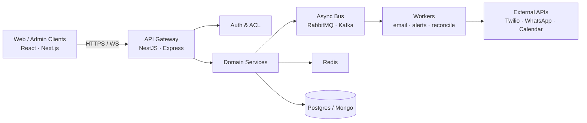

<!--
  PREVIEW — GitHub Profile README rewrite for musavirchukkan
  Review here first. After confirmation, copy into musavirchukkan/musavirchukkan.
-->

<div align="center">
  <a href="https://musavirchukkan.in">
    
  </a>
</div>

<p align="center">
  <a href="https://musavirchukkan.in"></a>
  <a href="mailto:abdulmusavirc@gmail.com"></a>
  <a href="https://www.linkedin.com/in/musavirchukkan/"></a>
  <a href="https://twitter.com/musavir_chukkan"></a>
  
</p>

---

## `~/system` — engineer profile

```bash
$ cat ~/.profile
name:        Abdul Musavir Chukkan
role:        Senior Software Engineer
focus:       [microservices, realtime, performance, integrations]
stack:       [TypeScript, Node.js, NestJS, React, PostgreSQL, Redis, Kafka]
experience:  4+ years shipping production systems
impact:      application performance ↑ ~80% on key workloads
status:      open_to_opportunities=true
```

I design and ship **event-driven backends**, **real-time clients**, and **integration-heavy platforms** — from bid engines and identity graphs to notification pipelines and API gateways.

<details>
<summary><strong>▸ Expand: current engineering focus</strong></summary>

<br/>

| Domain | What I'm building / optimizing |
| --- | --- |
| **Realtime systems** | WebSocket fan-out, auction/bidding loops, presence & low-latency updates |
| **Microservices** | NestJS / Node services with clear bounded contexts and async boundaries |
| **Data paths** | Postgres + Mongo + Redis caching; Redis/RabbitMQ/Kafka for work queues |
| **Integrations** | WhatsApp Cloud API, Facebook Lead API, Twilio, Google Calendar webhooks |
| **Ops** | Dockerized deploys, CI with GitHub Actions, Cloudflare edge patterns |

</details>

---

## Architecture I typically ship



<details>
<summary><strong>▸ Expand: design defaults</strong></summary>

- **Sync for reads / command path**, async for side-effects (email, webhooks, reconciliation)
- **Idempotent consumers** on queues; retry with backoff; dead-letter when needed
- **Cache-aside** on hot reads; invalidate on write paths that matter
- **Contract-first APIs** + typed clients (TypeScript end-to-end when possible)
- **Observability first**: structured logs, request IDs, actionable failure modes

</details>

---

## Featured systems

Click a repo to dive in. Each card highlights the **technical problem**, not just the feature list.

<table>
  <tr>
    <td width="50%" valign="top">
      <h3><a href="https://github.com/musavirchukkan/AuctionForge">AuctionForge</a></h3>
      <p><code>TypeScript</code> · realtime bidding · concurrency</p>
      <p>High-frequency multi-user auction engine: concurrent bid intake, integrity under load, and enterprise-grade reliability/security constraints.</p>
      <p>
        
        
      </p>
    </td>
    <td width="50%" valign="top">
      <h3><a href="https://github.com/musavirchukkan/identity-reconciliation">identity-reconciliation</a></h3>
      <p><code>TypeScript</code> · graph linking · CRM identity</p>
      <p>Contact identity graph that merges customer records across purchases into a single canonical profile — classic entity-resolution at request time.</p>
      <p>
        
        
      </p>
    </td>
  </tr>
  <tr>
    <td width="50%" valign="top">
      <h3><a href="https://github.com/musavirchukkan/email-microservice">email-microservice</a></h3>
      <p><code>TypeScript</code> · service boundary · async delivery</p>
      <p>Standalone mail service — isolates delivery, templates, and provider concerns from product APIs so domain services stay thin.</p>
      <p>
        
        
      </p>
    </td>
    <td width="50%" valign="top">
      <h3><a href="https://github.com/musavirchukkan/task-management-system">task-management-system</a></h3>
      <p><code>Laravel 12</code> · auth · workflow API</p>
      <p>Task assignment platform with authentication, ownership, and status transitions exposed as a clean REST API surface.</p>
      <p>
        
        
      </p>
    </td>
  </tr>
  <tr>
    <td width="50%" valign="top">
      <h3><a href="https://github.com/musavirchukkan/podcast-subscription-app">podcast-subscription-app</a></h3>
      <p><code>TypeScript</code> · subscriptions · product flow</p>
      <p>End-to-end subscription product for podcasts. <a href="https://www.youtube.com/shorts/YMIQm2TTo5Y">Watch demo</a>.</p>
    </td>
    <td width="50%" valign="top">
      <h3><a href="https://github.com/musavirchukkan/Habit0">Habit0</a></h3>
      <p><code>TypeScript</code> · streaks · gamification</p>
      <p>Habit tracker with streak rewards — state machines for daily completion and reward loops.</p>
    </td>
  </tr>
  <tr>
    <td width="50%" valign="top">
      <h3><a href="https://github.com/musavirchukkan/google-calendar-call-alert">google-calendar-call-alert</a></h3>
      <p><code>JavaScript</code> · webhooks · alerting</p>
      <p>Calendar-driven call alerts: event hooks → notification path for upcoming meetings.</p>
    </td>
    <td width="50%" valign="top">
      <h3><a href="https://github.com/musavirchukkan/mern-todo">mern-todo</a></h3>
      <p><code>MERN</code> · full stack · shipped</p>
      <p>Classic MERN todo with auth + CRUD. <a href="https://todo.musavirchukkan.in/">Live demo</a>.</p>
    </td>
  </tr>
</table>

---

## Interactive toolbox

<details open>
<summary><strong>▸ Tech stack map</strong> (click layers)</summary>

<br/>

**Languages**  
[](https://developer.mozilla.org/en-US/docs/Web/JavaScript)
[](https://www.typescriptlang.org/)
[](https://www.python.org/)
[](https://www.php.net/)
[](https://en.cppreference.com/w/c)

**Runtime & frameworks**  
[](https://nodejs.org/)
[](https://nestjs.com/)
[](https://expressjs.com/)
[](https://laravel.com/)
[](https://react.dev/)
[](https://nextjs.org/)

**Data, cache, messaging**  
[](https://www.postgresql.org/)
[](https://www.mongodb.com/)
[](https://www.mysql.com/)
[](https://redis.io/)
[](https://www.rabbitmq.com/)
[](https://kafka.apache.org/)

**Cloud & delivery**  
[](https://aws.amazon.com/)
[](https://www.docker.com/)
[](https://github.com/features/actions)
[](https://www.cloudflare.com/)
[](https://tailwindcss.com/)

</details>

<details>
<summary><strong>▸ Reliability checklist I run before ship</strong></summary>

```text
[ ] request timeouts + circuit breakers on external I/O
[ ] idempotency keys on payment / create / webhook handlers
[ ] queue retries + DLQ + alert on poison messages
[ ] authz checks on every mutating route (not just authn)
[ ] migration rollback plan + backward-compatible schema changes
[ ] load test hot path (p95 / error budget) before go-live
```

</details>

<details>
<summary><strong>▸ Competitive programming</strong></summary>

<br/>

<p>
  <a href="https://leetcode.com/musavirchukkan/"></a>
  <a href="https://www.hackerrank.com/musavirchukkan"></a>
  <a href="https://www.codechef.com/users/musavirchukkan"></a>
</p>

</details>

---

## Live metrics

<div align="center">
  <a href="https://github.com/ryo-ma/github-profile-trophy">
    
  </a>
</div>

<div align="center">
  <picture>
    <source media="(prefers-color-scheme: dark)" srcset="https://github-readme-stats.vercel.app/api?username=musavirchukkan&show_icons=true&theme=dark&hide_border=true&count_private=true&include_all_commits=true" />
    
  </picture>
  <picture>
    <source media="(prefers-color-scheme: dark)" srcset="https://streak-stats.demolab.com?user=musavirchukkan&theme=dark&hide_border=true" />
    
  </picture>
</div>

<div align="center">
  <picture>
    <source media="(prefers-color-scheme: dark)" srcset="https://github-readme-stats.vercel.app/api/top-langs/?username=musavirchukkan&layout=compact&theme=dark&hide_border=true&langs_count=8" />
    
  </picture>
  
</div>

---

## Contribution snake

<!-- SNAKE:START -->
<div align="center">
  <picture>
    <source media="(prefers-color-scheme: dark)" srcset="./assets/github-contribution-grid-snake-dark.svg" />
    
  </picture>
</div>
<!-- SNAKE:END -->

<details>
<summary><strong>▸ How this animation stays fresh</strong></summary>

<br/>

Generated from my real contribution grid via [Platane/snk](https://github.com/Platane/snk).  
The included Action regenerates `./assets/*.svg` daily so the snake keeps eating new green squares.

</details>

---

## Achievements

| | |
| --- | --- |
| 🏅 | **Best Performer** — Axel Technologies (2 consecutive periods) |
| 🧭 | **Vice Chairperson** — IEEE CS SBC MESCE (2020–2021) |
| 🏆 | **Regional Hackathon Winner** (2021) |
| 📈 | Grew IEEE chapter membership by **40%** |
| 👨‍🏫 | Trained **65+ students** in competitive programming |

---

## Connect / collaborate

```bash
$ ssh musavir@internet
> prefer: backend systems · realtime · fullstack product builds
> ping:   abdulmusavirc@gmail.com
> site:   https://musavirchukkan.in
> gh:     https://github.com/musavirchukkan
```

<p align="center">
  <a href="https://github.com/musavirchukkan"></a>
  <a href="https://www.linkedin.com/in/musavirchukkan/"></a>
  <a href="https://musavirchukkan.in"></a>
  <a href="mailto:abdulmusavirc@gmail.com"></a>
</p>

<p align="center"><em>Build systems that stay correct under pressure.</em></p>
